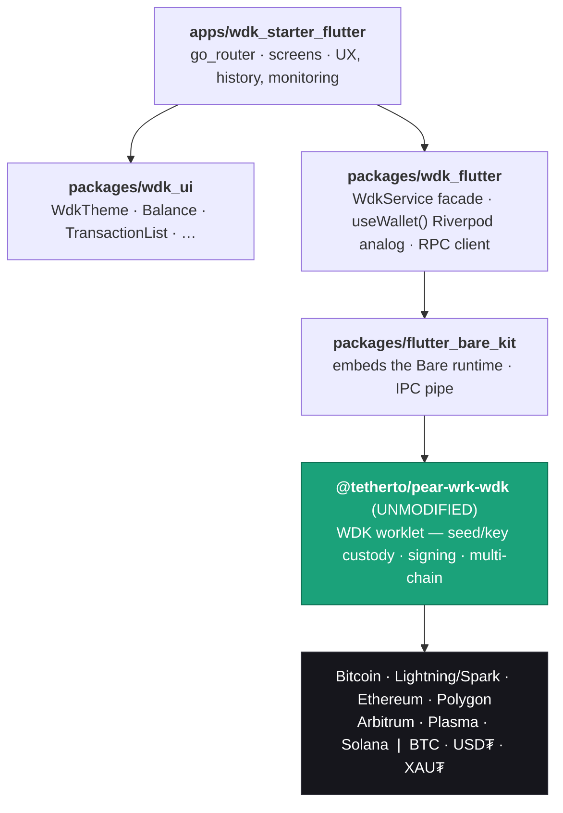
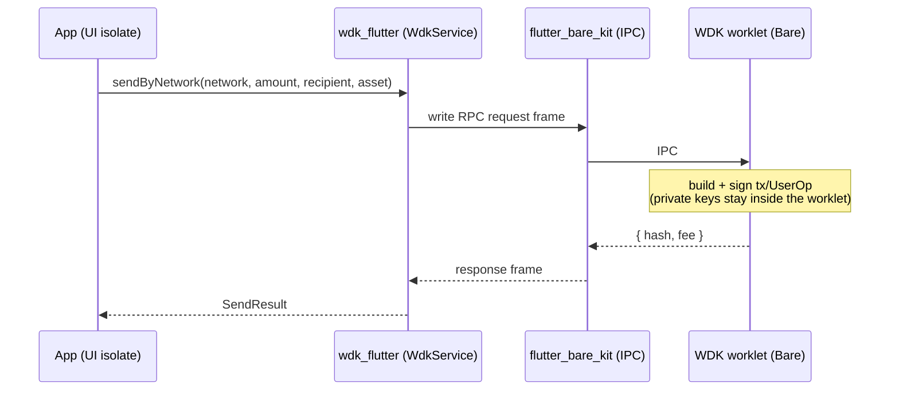

# wdk-starter-flutter

> A production-ready **Flutter Template Wallet** that integrates Tether's
> **Wallet Development Kit (WDK)** — the Flutter counterpart to the official
> [`wdk-starter-react-native`](https://github.com/tetherto/wdk-starter-react-native).

[](LICENSE)

> [!WARNING]
> **Alpha / work in progress.** This is the milestone-0 scaffold for the Tether
> "Template Wallet" bounty. The architecture, packages, app shell, theming, and
> the full screen map are in place and pass CI; the WDK worklet binding and live
> wallet flows are implemented across milestones M2–M3. **Do not use with real
> funds.** See [ROADMAP.md](ROADMAP.md).

## What this is

WDK's secure core is JavaScript that runs inside a **Bare worklet**
(`@tetherto/pear-wrk-wdk`) — it owns all seed/key custody and signing off the UI
thread. This project brings that to Flutter **without modifying WDK core**, by
adding the one piece Flutter is missing — a Bare binding — and reproducing the
React Native provider + UI + starter on top of it.

### Layered architecture



Because the real worklet is reused, every chain WDK supports — Bitcoin,
Lightning (Spark), Ethereum, Polygon, Arbitrum, Plasma, Solana — and every asset
— BTC, USD₮, XAU₮ — comes from upstream, not a reimplementation.

### Send flow (keys never leave the worklet)



## Repository layout

| Path | Description |
|------|-------------|
| `packages/flutter_bare_kit` | Flutter plugin embedding Holepunch's Bare runtime (loads the worklet bundle, IPC pipe). |
| `packages/wdk_flutter` | The provider: `WdkService` facade + Riverpod providers reproducing the RN `useWallet()` surface; enums, config, and the `code:X,msg:Y` error codec. |
| `packages/wdk_ui` | Themeable widget kit mirroring `wdk-uikit-react-native`. |
| `apps/wdk_starter_flutter` | The reference template app; `lib/config/chains.dart` is a faithful port of the RN `get-chains-config.ts`. |

## Prerequisites

- Flutter (stable, `>=3.41`) / Dart `>=3.11`
- Xcode (iOS) / Android SDK + NDK (Android)
- [Melos](https://melos.invertase.dev/) for workspace tasks: `dart pub global activate melos`

## Getting started

```bash
melos bootstrap          # or: run `flutter pub get` in each package
cd apps/wdk_starter_flutter
flutter run              # add --dart-define=WDK_INDEXER_API_KEY=... for live balances
```

Workspace tasks:

```bash
melos run analyze        # dart analyze across all packages
melos run format         # formatting check
melos run test           # all package + app tests
```

## Configuration

The app reads optional values from `--dart-define`:

| Key | Purpose | Default |
|-----|---------|---------|
| `WDK_INDEXER_URL` | WDK Indexer base URL | `https://wdk-api.tether.io` |
| `WDK_INDEXER_API_KEY` | Indexer API key (optional for dev) | empty |
| `TRON_API_KEY` / `TRON_API_SECRET` | Tron network (optional) | empty |

Chain endpoints and the ERC-4337 / paymaster / Electrum / relayer addresses live
in `apps/wdk_starter_flutter/lib/config/chains.dart`, ported verbatim from the
React Native starter. Swap the public RPC URLs for keyed endpoints in production.

## Status & roadmap

### What works today (verified in CI, no device needed)

- All Dart layers: provider/state, UI kit, indexer + pricing clients, address
  validation, the encrypted-seed salt — unit/widget tested.
- **The WDK wire protocol, byte-for-byte — both worklets.** `compact-encoding`,
  the **secret-manager** HRPC message codecs, the **manager** (`@wdk-core`) HRPC
  message codecs (all 15 commands, incl. `c.frame` nested objects), and the full
  **`bare-rpc` envelope** are ported to Dart and verified against Tether's *real*
  JS encoders (vectors in `tools/parity/`). Both worklet paths speak real HRPC
  end to end (`HrpcWorkletRpc` with `HrpcProtocol.secretManager` /
  `HrpcProtocol.wdkManager`), exercised by loopback round-trips incl. error
  frames and send-only `dispose`.

### What needs a device (native bring-up, in progress)

- The `flutter_bare_kit` native build (Android NDK/CMake + iOS BareKit pod) that
  actually runs the worklet, then loading the pinned worklet bundles (shipped in
  `wdk-react-native-provider@beta.3`), the on-device **same-mnemonic →
  same-address** check vs the RN starter, full multi-chain flows, and the demo
  video (M3).

The detailed plan, milestones, and risk register are in [ROADMAP.md](ROADMAP.md).

## License

[Apache-2.0](LICENSE) — matching upstream WDK.
